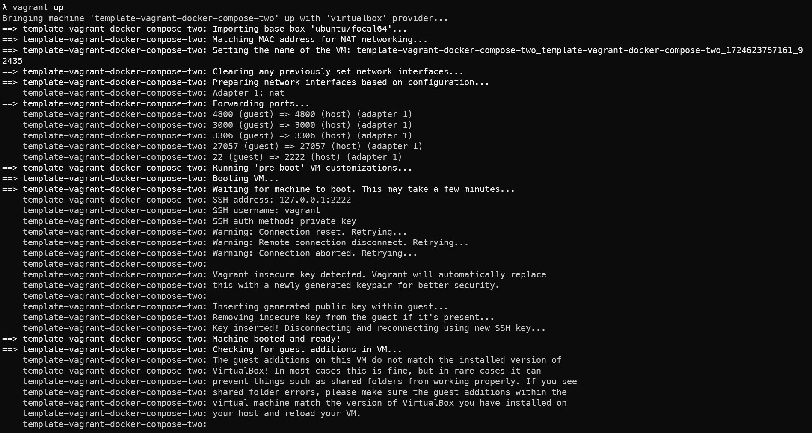
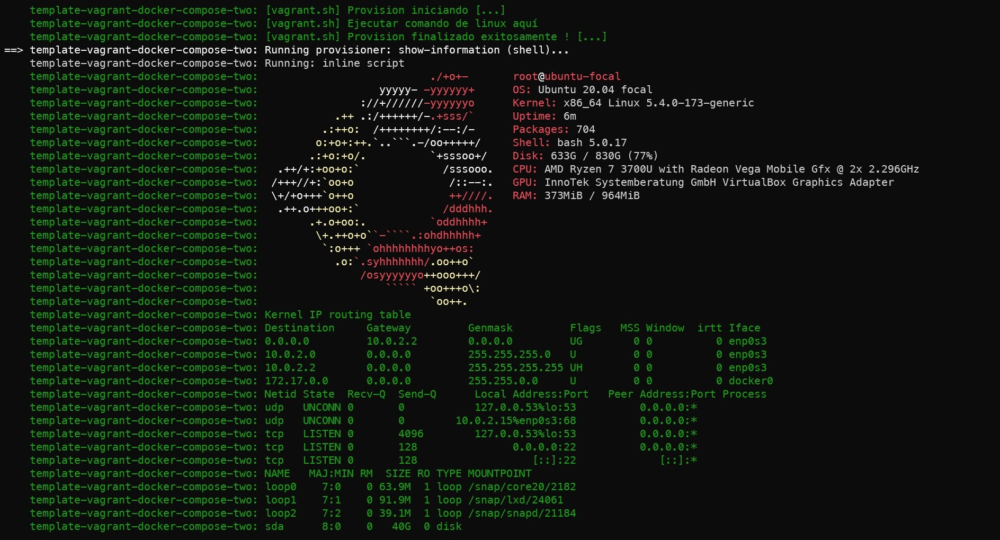
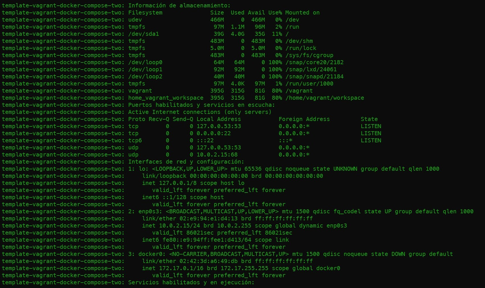
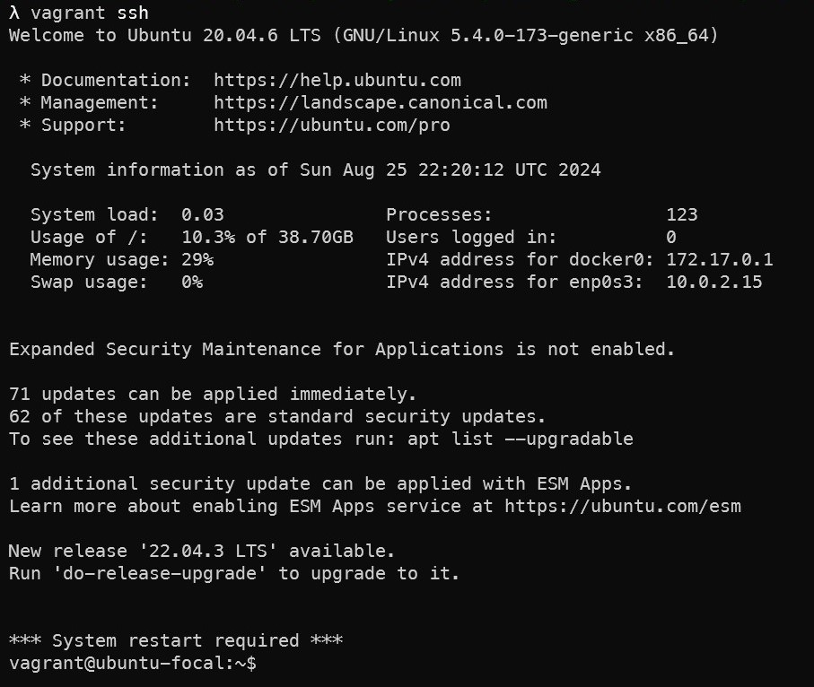

# Configuración básica de Vagrant

Este es una plantilla para arrancar vagrant que utiliza Ubuntu 20.04LTS.

Para acceder al sistema verifica si tienes el archivo ``.ssh/config``, de ser así tienes que renombrarlo temporalmente a ``backup_config`` 

## Cambios a realizar (Obligatorio)
Establece un nuevo nombre de la caja única, modifica el valor de config.vm.define

``config.vm.define "<nombre-de-la-caja-vagrant>"``

# Requisitos

Los requisitos necesarios para correr Vagrantfile son los siguientes:

- Vagrant v2.3.4 (o superior)
- VirtualBox v7.0 (o superior)
  - Extension_Pack v7.0.6 (o superior)

# Información

usuario: ``vagrant``
contraseña: ``vagrant``

Este caja de vagrant tiene instalado los siguiente:

- Docker version v27.1.2 (o lastest)
  - imagenes: "node:18.20-slim", "mysql:5.7" "mongo:6.0"
- Docker-compose v2.29.2
- nvm (Node Manager Version)
  - Instala la ultima version con: nvm install node

Alias creados para la caja:

- doc=docker-compose
- doc-rm="docker-compose stop && docker-compose rm --force"
- doc-again="docker-compose stop && docker-compose rm --force && docker-compose build && docker-compose up"
- docker-ps-clean="docker container prune -f"
- docker-images-clean="docker rmi $(docker images -f "dangling=true" -q)"

Herramientas de desarrollo:

 - vim nano curl wget tmux net-tools screenfetch zip unzip htop aptitude 
 - dos2unix tar build-essential software-properties-common ufw fail2ban
 - gdb httpie jq netcat nmap tree openssh-client software-properties-common gnupg2

# Instrucciones (de 8 Pasos)

Estos son los pasos a seguir para poder levantar la caja de Vagrant 

- Paso 1)
   
Instalar VirtualBox, Extension_Pack para VirtualBox y Vagrant.

- Paso 2) 

Inicializar un nuevo caja Vagrant.

```shell
$ vagrant init  
```

- Paso 3) 

Copiar todo el contenido del archivo ``Vagrantfile`` de este repositorio, y reemplazarlo por el archivo generado por el paso anterior.

- Paso 4) 

Descargar los archivos script shell para linux llamados, ``setup.sh`` y ``vagrant.sh``. Y colocarlos en la carpeta raíz del proyecto junto con el archivo ``Vagrantfile``.

- Paso 5) 

Ejecuta el siguiente comando para arrancar la caja de vagrant. (Esto dura aprox. 15 min. la primera vez)

```shell
$ vagrant up
```

- Paso 6)

Entrar a la caja de vagrant  

```shell
$ vagrant ssh
```

- Paso 7) (Opcional)

Instalar NVM, instalar la ultima versión de NodeJS y crear alias para Docker y Docker-compose

```shell
$ cd ~/workspace
$ dos2unix ./setup.sh
$ ./setup.sh
$ source ~/.bashrc
```

- Paso 8) (Opcional)

Verificar toda la instalación de NodeJS, NVM, Docker, Docker-compose, Imagenes Docker, alias

```shell
$ node --version
$ nvm --version
$ docker --version
$ docker-compose --version
$ docker images
$ alias
```

# Screenshots




